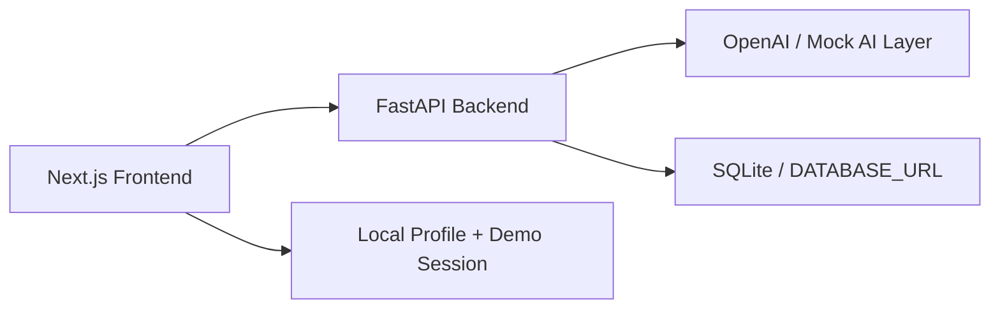

# CareerCopilot AI

Contest-ready AI-powered career intelligence workspace for students.

## Included

- `frontend/`: Next.js App Router starter
- `backend/`: FastAPI API starter
- `shared/prompts/`: prompt templates for analysis and roadmap generation

## Demo URLs

- `http://127.0.0.1:3100/`
- `http://127.0.0.1:3100/upload`
- `http://127.0.0.1:3100/dashboard`
- `http://127.0.0.1:3100/market`
- `http://127.0.0.1:3100/interview`
- `http://127.0.0.1:3100/signin`
- `http://127.0.0.1:3100/workspace`
- `http://127.0.0.1:8000/docs`

## Project Story

CareerCopilot AI is designed as a student-focused career intelligence system rather than a single chatbot. The goal is to show employers a combination of:

- full-stack product thinking
- AI-assisted analysis and coaching
- persistent user workflows
- a polished demo experience

## Why This Is Contest-Ready

- Clear real-world problem with a large user base
- Multiple connected AI workflows instead of a single prompt box
- Strong live-demo narrative from analysis to action
- Polished UX with dashboarding, exports, and personalization
- Safe demo-mode fallback so the product remains presentable under pressure

## Architecture



## MVP Flow

1. Upload a resume
2. Paste a target job description
3. Generate a match report with skill gaps and resume improvements
4. Generate a 30 / 60 / 90 day roadmap

## Current Features

- Resume upload with `PDF`, `DOCX`, `TXT`, `MD`, and fallback plain-text support
- AI-driven job match analysis with mock fallback when no API key is present
- Saved analysis reports backed by local SQLite
- Detail pages for revisiting earlier analyses
- Dashboard view for browsing recent analyses
- Market intelligence page with role-based demand and skill signals
- Mock interview page with tailored questions and answer feedback
- Lightweight demo sign-in flow with a persistent local session
- Personal workspace page with saved name, role, region, and goal defaults
- One-click demo data flows for faster live walkthroughs

## Frontend

```bash
cd frontend
npm install
npm run dev
```

The frontend expects the backend at `http://127.0.0.1:8000`.

For a steadier local experience, use the production build flow instead:

```bash
cd frontend
npm run build
npm run start
```

Optional frontend environment variables:

```bash
NEXT_PUBLIC_API_BASE_URL=http://127.0.0.1:8000
NEXT_PUBLIC_DEMO_MODE=true
```

You can copy from `frontend/.env.example`.

## Backend

```bash
cd backend
python -m venv .venv
.venv\Scripts\activate
pip install -r requirements.txt
uvicorn app.main:app --reload
```

Backend environment variables:

```bash
OPENAI_API_KEY=
DATABASE_URL=sqlite:///./career_copilot.db
CORS_ORIGINS=http://127.0.0.1:3100,http://localhost:3100
```

You can copy from `backend/.env.example`.

## Local App Scripts

From the `career-copilot-ai` folder on Windows:

```powershell
.\start-local.ps1
.\open-local.ps1
.\status-local.ps1
.\stop-local.ps1
```

If PowerShell blocks local scripts on your machine, use the Command Prompt launchers instead:

```bat
start-local.cmd
open-local.cmd
```

These launchers start the backend on `8000`, start the frontend on `3100`, and open the app in your browser.

On the first run they may also create `backend/.venv` and install the backend Python packages automatically.

If clicking a local link inside another app opens an embedded preview, use:

```powershell
.\start-local.ps1
```

That launches the site in your normal browser automatically.

## Notes

- Resume upload now parses `PDF` and `DOCX` files on the backend.
- LLM calls fall back to deterministic mock output when `OPENAI_API_KEY` is not set.
- The backend now persists generated analyses in a local SQLite database by default.
- Saved reports can be revisited at `/analysis/<id>` in the frontend.
- The app surfaces a demo-mode banner by default so portfolio viewers understand when mock AI output is being used.

## Fast Demo Script

1. Open `/upload` and click `Load demo data`
2. Click `Generate report`
3. Open `/market` and run a role snapshot
4. Open `/dashboard` to show saved analyses and trend summaries
5. Open `/interview`, click `Load demo data`, then `Generate questions`
6. Select a question and click `Get feedback`

This flow gives you a clean 60 to 90 second portfolio demo without manual typing.

## Contest Assets

- Submission brief: [CONTEST_SUBMISSION.md](/C:/Users/arees/OneDrive/Documents/New%20project/career-copilot-ai/CONTEST_SUBMISSION.md)
- Demo walkthrough: [DEMO_SCRIPT.md](/C:/Users/arees/OneDrive/Documents/New%20project/career-copilot-ai/DEMO_SCRIPT.md)
- Spoken pitch: [PITCH.md](/C:/Users/arees/OneDrive/Documents/New%20project/career-copilot-ai/PITCH.md)
- Devpost draft: [DEVPOST_SUBMISSION.md](/C:/Users/arees/OneDrive/Documents/New%20project/career-copilot-ai/DEVPOST_SUBMISSION.md)
- Video script: [VIDEO_SCRIPT.md](/C:/Users/arees/OneDrive/Documents/New%20project/career-copilot-ai/VIDEO_SCRIPT.md)

## Deployment

See [DEPLOYMENT.md](/C:/Users/arees/OneDrive/Documents/New%20project/career-copilot-ai/DEPLOYMENT.md) for a production-oriented setup using `Vercel` for the frontend and `Render` or `Railway` for the backend.
