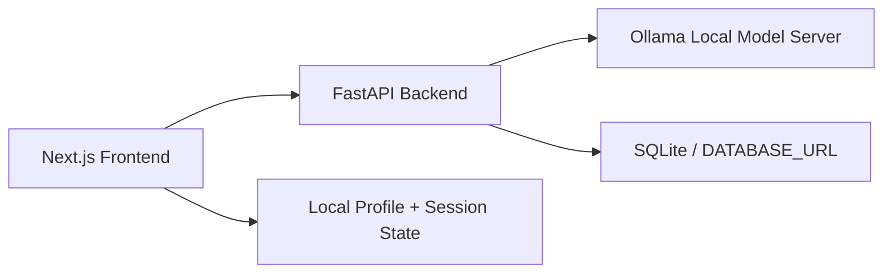

# CareerCopilot AI

CareerCopilot AI is a career intelligence workspace for students with a real local AI backend powered by `Ollama`.

## Included

- `frontend/`: Next.js app
- `backend/`: FastAPI API
- `shared/prompts/`: prompt templates for analysis, roadmap, and market generation

## What It Does

- Resume upload and parsing for `PDF`, `DOCX`, `TXT`, and `MD`
- Resume-to-job analysis with match score, skill gaps, and rewritten bullets
- Personalized `30 / 60 / 90 day` roadmap generation
- Interview question generation and answer feedback
- Market snapshot generation for target roles and regions
- Saved analysis history with a dashboard
- Workspace profile and lightweight sign-in flow

## AI Provider

The app now uses `Ollama` instead of OpenAI.

Recommended local setup:

```bash
ollama pull qwen3
ollama serve
```

You can change models through environment variables.

## Local URLs

- `http://127.0.0.1:3100/`
- `http://127.0.0.1:3100/upload`
- `http://127.0.0.1:3100/dashboard`
- `http://127.0.0.1:3100/market`
- `http://127.0.0.1:3100/interview`
- `http://127.0.0.1:3100/signin`
- `http://127.0.0.1:3100/workspace`
- `http://127.0.0.1:8000/docs`

## Architecture



## Frontend

```bash
cd frontend
npm install
npm run dev
```

Frontend environment variables:

```bash
NEXT_PUBLIC_API_BASE_URL=http://127.0.0.1:8000
NEXT_PUBLIC_DEMO_MODE=false
```

## Backend

```bash
cd backend
python -m venv .venv
.venv\Scripts\activate
pip install -r requirements.txt
uvicorn app.main:app --reload
```

Backend environment variables:

```bash
DATABASE_URL=sqlite:///./career_copilot.db
CORS_ORIGINS=http://127.0.0.1:3100,http://localhost:3100
OLLAMA_BASE_URL=http://127.0.0.1:11434
OLLAMA_MODEL=qwen3
```

## Windows Startup Scripts

From the `career-copilot-ai` folder:

```powershell
.\start-local.ps1
.\open-local.ps1
.\status-local.ps1
.\stop-local.ps1
```

If PowerShell script execution is blocked, use:

```bat
start-local.cmd
open-local.cmd
```

## Important Notes

- The backend no longer falls back to fake AI responses in live mode.
- If Ollama is not running, the API will return honest errors instead of mock data.
- The public Vercel frontend can stay online, but real AI generation requires a backend that can reach an Ollama server.
- The simplest real setup is local frontend + local backend + local Ollama.

## GitHub

- Repo: [https://github.com/arianar123/career-copilot-ai](https://github.com/arianar123/career-copilot-ai)

## Deployment

The current public frontend is deployed on Vercel, but a fully live AI deployment requires hosting an Ollama-accessible backend or swapping to a hosted model provider.
